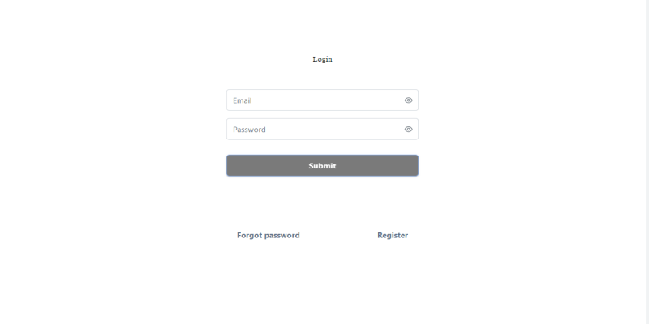
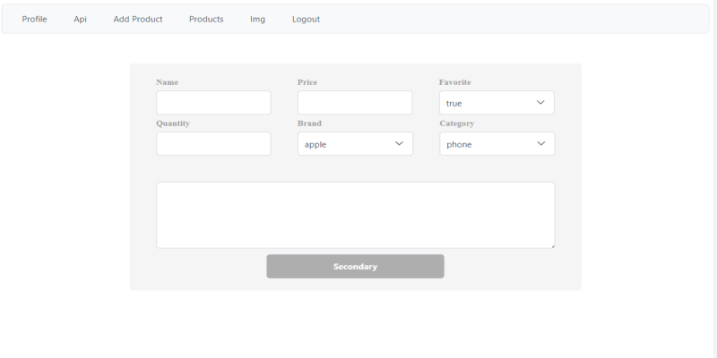
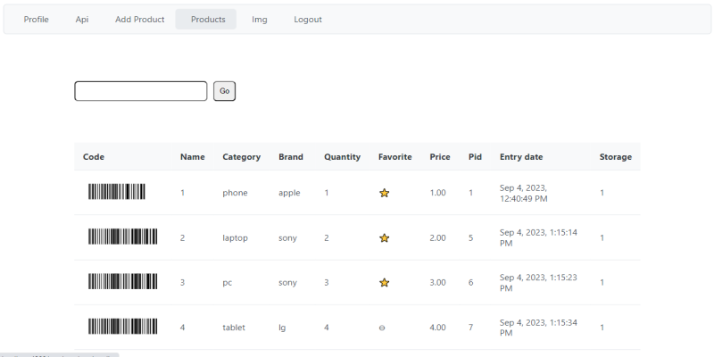
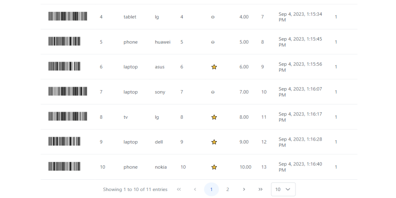
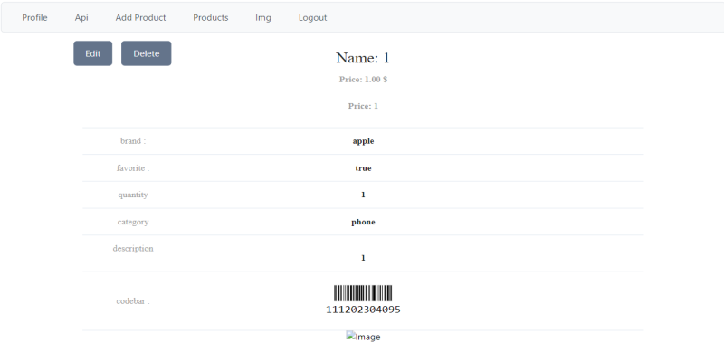

# Angular Express Mysql CRUD

> The Angular project  v16.2.0 for the core framework, along with PrimeNG and PrimeFlex for UI components and layout .  
> Barcode generation is facilitated by jsbarcode and ngx-barcode6 libraries.   
> On the other hand, the Express project serves as the backend, written in Node.js.  
> It uses express v4.18.2 and integrates additional packages for security like Helmet, rate-limiting, and JSON Web Tokens for authentication.  
> It also uses MySQL as its database through the mysql2 package. Both projects are set up for development with respective dev tools.
> 

> 
> 
> 
> 
> 